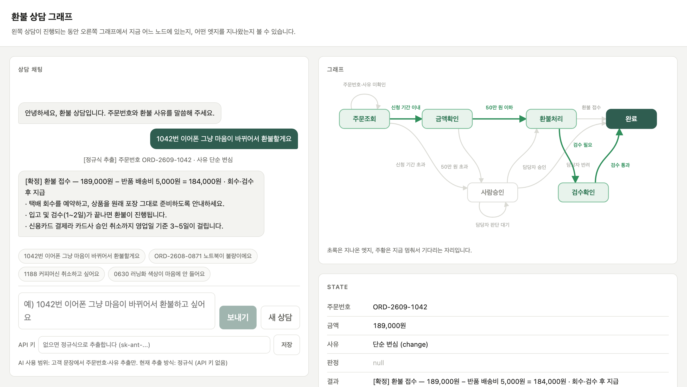

# 환불 상담 그래프

고객 문장을 받아 환불 가능 여부를 판정하는 상담 웹앱입니다.
앱의 모든 흐름이 **엣지 배열 하나**에 선언되어 있고, 화면은 그 배열을 읽어 그립니다.

**▶ [바로 실행해 보기](https://ifree015.github.io/refund-consult-graph/)** — 설치 없이 브라우저에서 바로 씁니다.

앱은 파일 하나입니다. 빌드 도구도 의존성도 없습니다.

```
index.html   앱 전체 (HTML + CSS + JS)
test.js      테스트 (node 내장 기능만 사용)
docs/        이 문서에 쓰는 화면 캡처
```

---

## 실행 방법

### 브라우저에서 바로

https://ifree015.github.io/refund-consult-graph/

GitHub Pages로 `main` 브랜치의 `index.html`을 그대로 서빙합니다. push하면 몇 분 안에 반영됩니다.

### 내려받아서 열기

```bash
open index.html          # macOS
xdg-open index.html      # Linux
start index.html         # Windows
```

파일을 브라우저로 열기만 하면 됩니다. 서버가 필요하지 않습니다.

로컬 서버로 띄우고 싶다면:

```bash
python3 -m http.server 8000
# http://localhost:8000
```

### 테스트 돌리기

```bash
node test.js
```

`index.html`에서 스크립트를 직접 읽어 검사하므로 코드 사본이 없습니다.
전부 통과하면 종료 코드 `0`, 하나라도 실패하면 `1`과 함께 어긋난 지점을 출력합니다.

```
전부 통과 — 검증 75건
```

---

## 써 보기

입력창 위의 예시 문장을 누르면 각각 다른 경로로 진행합니다.



위는 `1042번 이어폰 그냥 마음이 바뀌어서 환불할게요` 를 넣은 결과입니다.
단순 변심이라 회수한 물건을 검수해야 하므로 **환불처리에서 검수확인으로 내려갔다가 완료로** 올라갑니다.
같은 주문이라도 `1042번 이어폰 오배송이에요` 처럼 판매자 귀책이면 검수확인을 건너뛰고 환불처리에서 곧장 완료로 갑니다.

| 예시 문장 | 금액 | 지나가는 길 |
|---|---|---|
| 1042번 이어폰 그냥 마음이 바뀌어서 | 189,000원 | 환불처리 → 검수확인 → 완료 (안 멈춤) |
| 1188 커피머신 취소하고 싶어요 | 620,000원 | **사람승인에서 멈춤** |
| ORD-2608-0871 노트북이 불량이에요 | 1,450,000원 | **사람승인에서 멈춤** |
| 0630 러닝화 색상이 마음에 안 들어요 | 89,000원 | 신청 기간 초과 → **사람승인에서 멈춤** |

사람승인에서 멈추면 채팅에 **승인 / 거절** 버튼이 나옵니다. 누르면 멈춰 있던 자리에서 이어서 실행됩니다.

직접 문장을 써도 됩니다. 주문번호나 사유 한쪽만 말하면 주문조회에 머물면서 나머지를 되묻습니다.

오른쪽 화면에서 지나온 엣지는 초록, 지금 멈춰서 기다리는 자리는 주황으로 칠해집니다.

---

## 구조

### 노드 6개

각 노드는 `state`의 값을 채우기만 하고, 다음에 어디로 갈지는 결정하지 않습니다.

| 노드 | 하는 일 |
|---|---|
| 주문조회 | 주문번호로 주문 데이터를 찾아 결제 금액을 `state.금액`에 채운다 |
| 금액확인 | `state.금액`을 승인 한도와 비교한 사실을 기록한다 |
| 사람승인 | 담당자가 버튼을 누를 때까지 여기서 멈춘다 |
| 환불처리 | 차감 항목을 반영해 환불 금액을 계산한다 |
| 검수확인 | 회수한 상품의 상태를 확인한 뒤 환불금을 지급한다 |
| 완료 | 상담 결과를 확정한다 |

### 엣지 배열

`[현재 노드, 조건 이름, 조건 함수, 다음 노드]` 형태입니다.
위에서부터 확인해 **조건이 처음으로 맞는 줄 하나**만 따라갑니다.
현재 노드와 다음 노드가 같은 줄은 **제자리** — 입력이 올 때까지 그 자리에서 멈춥니다.

```js
var EDGES = [
  ['주문조회', '주문번호·사유 미확인', 미확인,          '주문조회'],
  ['주문조회', '신청 기간 초과',       신청기간_초과,   '사람승인'],
  ['주문조회', '신청 기간 이내',       신청기간_이내,   '금액확인'],

  ['금액확인', '50만 원 초과',         금액이_한도_초과, '사람승인'],
  ['금액확인', '50만 원 이하',         금액이_한도_이하, '환불처리'],

  ['사람승인', '담당자 판단 대기',     판단_대기,       '사람승인'],
  ['사람승인', '담당자 승인',          담당자_승인,     '환불처리'],
  ['사람승인', '담당자 반려',          담당자_반려,     '완료'],

  ['환불처리', '검수 필요',            검수필요,        '검수확인'],
  ['환불처리', '환불 접수',            항상,            '완료'],

  ['검수확인', '검수 통과',            항상,            '완료']
];
```

엔진은 `다음엣지()`와 `이어서실행()` 두 함수가 전부입니다.

### state

모든 노드가 함께 쓰는 객체 하나입니다.

```js
{ 주문번호, 금액, 사유, 판정, 결과 }
```

- `금액` — 주문조회 노드가 **주문 데이터에서 조회해** 채웁니다. AI가 추측하지 않습니다.
- `판정` — 사람승인에서 담당자가 누르는 값 (`'승인'` / `'반려'`)
- `결과` — 각 노드가 남기는 처리 결과

### 파일 안의 순서

`index.html`은 스크립트 블록 세 개로 나뉘어 있고, 화면보다 그래프가 먼저 옵니다.

1. **그래프 선언** — 정책 상수, 주문 데이터, state, 노드, 조건 함수, EDGES, 엔진
2. **입력 추출** — 고객 문장에서 주문번호·사유 뽑기 (AI 또는 정규식)
3. **화면** — state와 실행 위치를 그리기만 함. 흐름 판단은 하지 않음

---

## AI를 쓰는 범위

AI는 **고객 문장에서 주문번호와 환불 사유를 뽑는 데에만** 씁니다.
금액이나 승인 여부처럼 판단이 필요한 값은 묻지 않습니다.

- **API 키가 없으면** 정규식으로 추출합니다. 이 상태로도 앱이 전부 동작합니다.
- **API 키가 있으면** Claude API(`claude-opus-5`, 구조화 출력)로 추출합니다.

어느 쪽이든 뽑아낸 값은 `검증()`을 통과해야 합니다. 주문번호는 실제 주문 목록에 있어야 하고,
사유는 정의된 네 코드 중 하나여야 채택됩니다. API 호출이 실패하면 정규식으로 대체됩니다.

화면 아래쪽 입력칸에 키를 넣고 저장하면 됩니다. 지금 어느 방식으로 도는지는 맨 아랫줄에 표시됩니다.

> **주의** 브라우저에서 API를 직접 호출하는 구조라 키가 그 페이지에 노출됩니다.
> 연습용이라 이렇게 두었습니다. 실제 서비스라면 서버를 한 번 거쳐야 합니다.

---

## 환불 정책

| 항목 | 값 |
|---|---|
| 상담사 승인 한도 | 500,000원 — **넘으면** 담당자 검토 |
| 반품 배송비 | 5,000원 — 단순 변심에만 차감 |
| 신청 기한 | 단순 변심 7일 / 상품 하자·오배송·배송 지연 30일 |
| 배송 완료 전 | 반품이 아닌 주문 취소로 처리, 배송비 차감 없음 |
| 회수·검수 | 단순 변심으로 물건을 돌려받는 건만 검수확인을 거침 |

정책 상수는 `index.html` 맨 위(`승인한도`, `반품배송비`, `사유표`)에 있고,
화면의 「환불 정책」 패널은 이 값에서 문장을 만들어 내므로 코드와 어긋나지 않습니다.

## 연습용 주문 데이터

50만 원 이하 2건, 초과 2건이 들어 있습니다.

| 주문번호 | 상품 | 금액 | 배송 상태 |
|---|---|---|---|
| ORD-2609-1042 | 무선 이어폰 | 189,000원 | 배송완료 (3일 경과) |
| ORD-2608-0630 | 러닝화 270mm | 89,000원 | 배송완료 (21일 경과) |
| ORD-2609-1188 | 전자동 커피머신 | 620,000원 | 배송중 |
| ORD-2608-0871 | 14인치 노트북 | 1,450,000원 | 배송완료 (6일 경과) |

경과일은 오늘을 기준으로 계산되므로 언제 열어도 같은 결과가 나옵니다.

---

## 테스트가 검사하는 것

| 단계 | 내용 |
|---|---|
| 1부 | 정규식 추출 42문장 — 주문번호 표기 변형, 사유 네 종류, 사유가 겹칠 때의 우선순위, 숫자 오검출 함정 |
| 2부 | 그래프 흐름 7건 — 금액이 주문 데이터와 일치하는지, 지나온 경로, 멈춘 노드 |
| 3부 | 사람승인에서 멈췄다가 승인·반려로 이어서 실행되는지 |
| 4부 | EDGES 배열 점검 — 모든 줄이 네 칸인지, 가리키는 노드가 실재하는지, 종착 노드가 완료 하나뿐인지, 주문조회에서 모든 노드에 닿는지 |

엣지를 새로 추가할 때는 4부가 오타(없는 노드 이름)와 고아 노드를 잡아 줍니다.

---

## 알려진 한계

- 한 문장에 주문번호가 둘 이상이면 첫 번째만 인식합니다.
- "색상이 달라요"처럼 단순 변심인지 오배송인지 사람도 헷갈리는 문장은 단순 변심으로 갑니다.
  API 키를 넣으면 이런 문장의 판단이 나아집니다.
- 상담 내용은 저장되지 않습니다. 새로고침하면 사라집니다.
